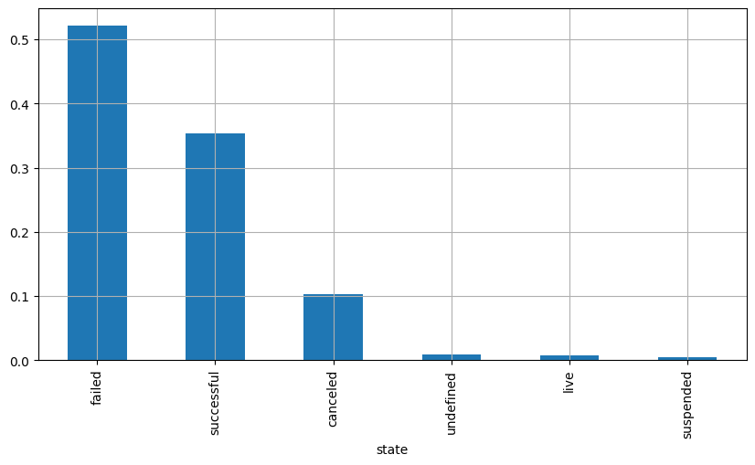
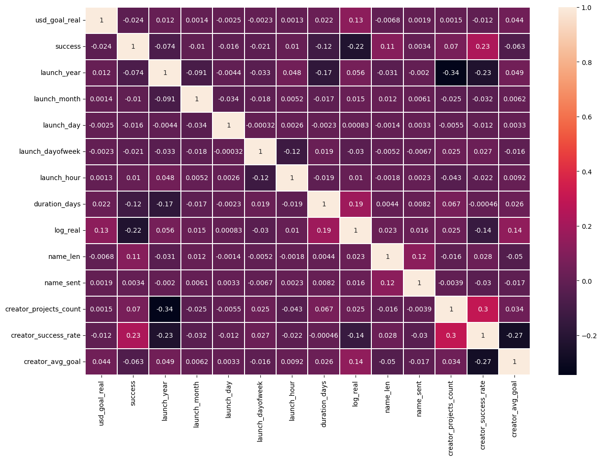
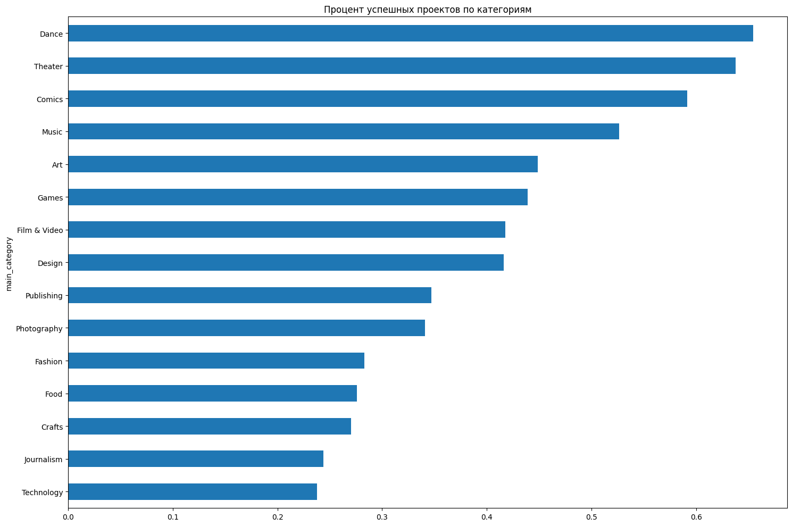
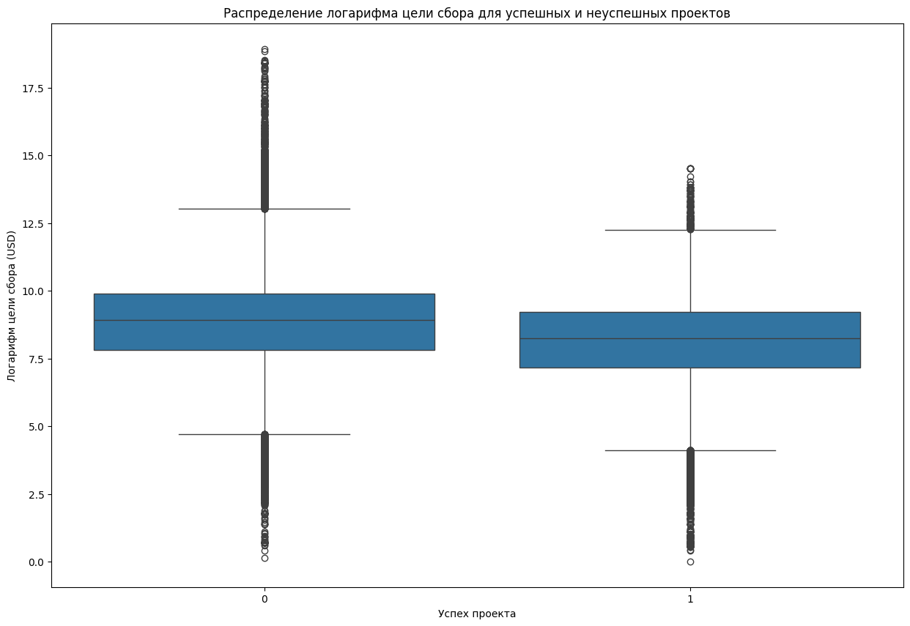
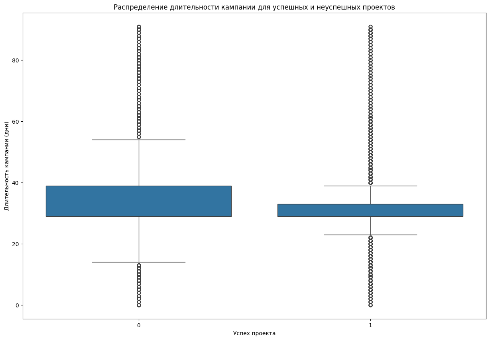
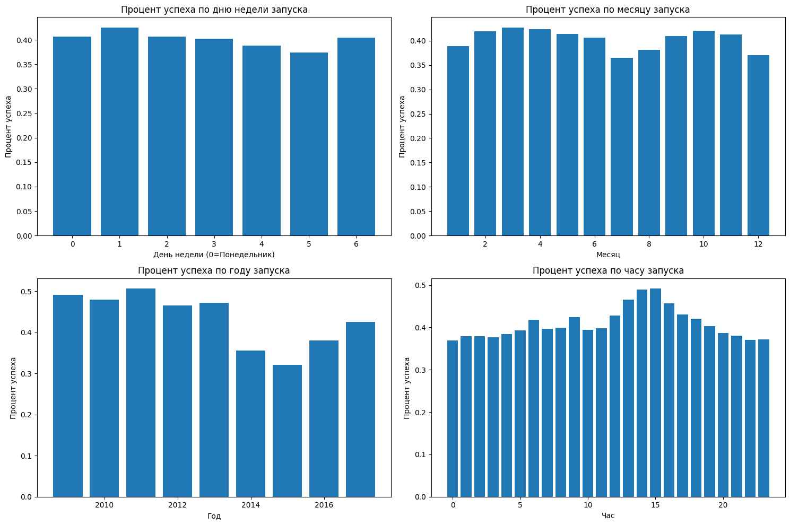
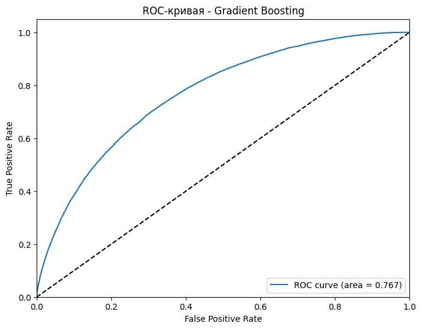
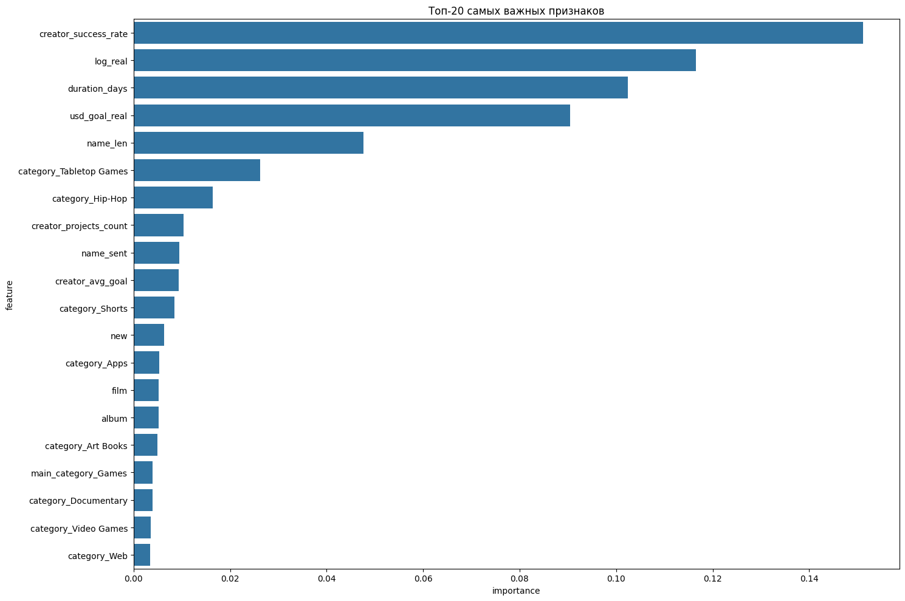

# Kickstarter Success Prediction MLOps Pipeline
Проект для предсказания успешности проектов на Kickstarter с использованием современных MLOps практик, включая версионирование данных (DVC), трекинг экспериментов (MLflow) и автоматизацию пайплайнов.

## 📊 О проекте
Этот проект решает задачу бинарной классификации для предсказания успешности краудфандинговых проектов на платформе Kickstarter. Модель машинного обучения анализирует различные характеристики проектов, такие как категория, цель сбора, длительность кампании, историю создателя и другие факторы.

## ⚙️ Установка и запуск

### 1. Скачать датасет 

``` bash
https://www.kaggle.com/datasets/kemical/kickstarter-projects/data
```
<i><b>Скачать ks-projects-201801.csv</b></i>

### 2. Клонирование репозитория

```bash
git clone https://github.com/0GMEL/Kickstarter-Success-Prediction-MLOps-Pipeline.git
cd Kickstarter-Success-Prediction-MLOps-Pipeline
```

### 3. Установка зависимостей

```bash
pip install -r requirements.txt
```

### 4. Запуск полного пайплайна

```bash
# Инициализация DVC (если еще не выполнено)
dvc init

# Запуск полного пайплайна обработки данных и обучения моделей
dvc repro
```

### 5. Просмотр результатов экспериментов

```bash
# Запуск MLflow UI для просмотра результатов экспериментов
mlflow server --host 127.0.0.1 --port 5000
```


## Данные

### Источник данных
- **Датасет**: [Kickstarter Projects](https://www.kaggle.com/kemical/kickstarter-projects)
- **Период**: Проекты с 2009 по 2018 год
- **Размер**: ~300,000 записей

### Признаки
- **Категория и подкатегория** проекта
- **Цель сбора** средств (в USD)
- **Страна** запуска проекта
- **Длительность** кампании (в днях)
- **Время запуска** (год, месяц, день, час)
- **Текстовые признаки** названия проекта (длина, тональность)
- **История создателя** (количество предыдущих проектов, процент успеха)

### Целевая переменная
- **success**: Бинарный показатель успешности проекта (1 = успешный, 0 = неудачный)

## Эксперименты

Проект включает несколько экспериментов с различными алгоритмами и гиперпараметрами:

### Модели
1. **Random Forest** с базовыми параметрами
2. **Random Forest** с настроенными параметрами
3. **Gradient Boosting** с базовыми параметрами  
4. **Gradient Boosting** с настроенными параметрами
- <i><b>настроенные параметры были получены в notebooks/Variant2, там же есть и графики</b></i>

### Метрики оценки
- **ROC-AUC**: Площадь под ROC-кривой = 0.7671
- **Accuracy**: Точность предсказаний = 0.7056
- **Precision**: Точность положительных предсказаний = 0.6628
- **Recall**: Полнота положительных предсказаний = 0.5520
- **F1-score**: Гармоническое среднее precision и recall = 0.6023
* все эти метрики описываются в ноутбке Variant2

## Ключевые особенности

1. **Автоматизированный пайплайн**: DVC управляет зависимостями между этапами обработки данных и обучения моделей
2. **Версионирование данных**: Все данные и модели находятся под контролем версий
3. **Трекинг экспериментов**: MLflow отслеживает все параметры, метрики и артефакты экспериментов

## EDA
1. ### Размерность
```bash
df.shape
``` 
(378661, 15)
2. ### Распределение
```bash 
status_c = df['state'].value_counts(normalize = True)
```
- failed = 0.522153
- successful = 0.353762
- canceled = 0.102411
- undefined = 0.009407
- live = 0.007392
- suspended = 0.004875

3. ### Корреляция

4. ### Процент успешных проектов по категориям

5. ### Распределение логарифма цели сбора для успешных и неуспешных проектов

6. ### Распределение длительности кампании для успешных и неуспешных проектов

7. ### Процент успеха относительно времени

8. ### Сравнение производительностей моделей

9. ### ROC-кривая

10. ### Важность признаков
